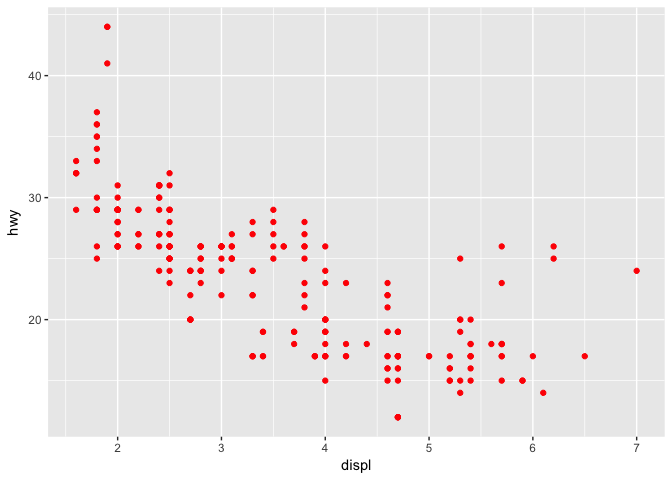
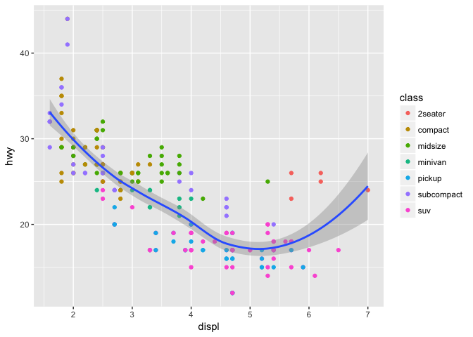
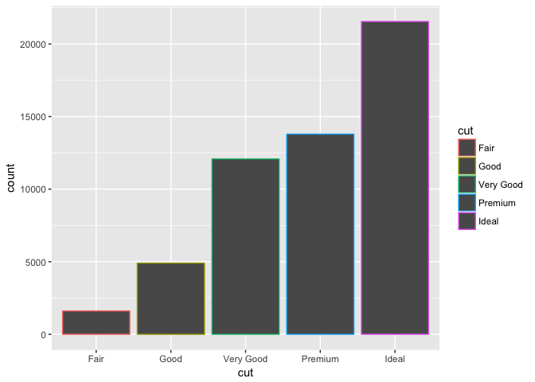

ggplot2 and visualization
================

-   [Creating a ggplot](#creating-a-ggplot)
-   [Aesthetic Mappings](#aesthetic-mappings)
-   [Facets](#facets)
-   [Geometric Objects](#geometric-objects)
-   [Statistical Transformations and Position Adjustments](#statistical-transformations-and-position-adjustments)

Include the tidyverse package always:

``` r
library(tidyverse)
```

mpg is a data frame tibble from ggplot2 where variables in the columns and observations are in the rows displ: car engine size in liters hwy: car fuel effiency on highway

``` r
ggplot2::mpg
```

    ## # A tibble: 234 x 11
    ##    manufacturer      model displ  year   cyl      trans   drv   cty   hwy
    ##           <chr>      <chr> <dbl> <int> <int>      <chr> <chr> <int> <int>
    ##  1         audi         a4   1.8  1999     4   auto(l5)     f    18    29
    ##  2         audi         a4   1.8  1999     4 manual(m5)     f    21    29
    ##  3         audi         a4   2.0  2008     4 manual(m6)     f    20    31
    ##  4         audi         a4   2.0  2008     4   auto(av)     f    21    30
    ##  5         audi         a4   2.8  1999     6   auto(l5)     f    16    26
    ##  6         audi         a4   2.8  1999     6 manual(m5)     f    18    26
    ##  7         audi         a4   3.1  2008     6   auto(av)     f    18    27
    ##  8         audi a4 quattro   1.8  1999     4 manual(m5)     4    18    26
    ##  9         audi a4 quattro   1.8  1999     4   auto(l5)     4    16    25
    ## 10         audi a4 quattro   2.0  2008     4 manual(m6)     4    20    28
    ## # ... with 224 more rows, and 2 more variables: fl <chr>, class <chr>

### Creating a ggplot

The plot shows a negative relationship btw displ and hwy (cars w/big engines use more fuel).

``` r
library(ggplot2) #Repeat it for the first time in a .Rmd document to get knitr worked
ggplot(data = mpg) +
  geom_point(mapping = aes(x = displ, y = hwy))
```


On that matter, a general template for `ggplot2::ggplot` function is; &gt; ggplot(data = <DATA>) + &gt; <GEOM_FUNCTION>(mapping = aes(<MAPPINGS>))

### Aesthetic Mappings

Mapping *aesthetic*: a third var. like **size**, **shape**, **color**.

``` r
head(factor(mpg$class))
```

    ## [1] compact compact compact compact compact compact
    ## Levels: 2seater compact midsize minivan pickup subcompact suv

You can map the colors of your points to the `class` variable to reveal the **class** of each car. Assigning a unique level of the aesthetic (the example below is color) to each unique value of the variable is known as *scaling*. ggplot2 adds legend automatically.

``` r
ggplot(data = mpg) +
  geom_point(mapping = aes(x = displ, y = hwy, color = class))
```


Below is those which year &gt; 2000 brings (the boolean operator)

``` r
ggplot(data = mpg) +
  geom_point(mapping = aes(x = displ, y = hwy, color = year > 2000))
```


Mapping `class` to *alpha* aesthetic which can control the transparency or shape of the points

``` r
ggplot(data = mpg) +
  geom_point(mapping = aes(x = displ, y = hwy, alpha = class))
```


Shape scaling (with max 6 discrete values in the variable) and six shapes. **Additional groups will be unplotted when you use this aesthetic.**

``` r
ggplot(data = mpg) +
  geom_point(mapping = aes(x = displ, y = hwy, shape = class))
```

    ## Warning: The shape palette can deal with a maximum of 6 discrete values
    ## because more than 6 becomes difficult to discriminate; you have 7.
    ## Consider specifying shapes manually if you must have them.

    ## Warning: Removed 62 rows containing missing values (geom_point).


Using and choosing color in aesthetic properties. ggplot2 does not create a legend for x and y aesthetics but it creates axis line with tick marks and a label (as others).

``` r
ggplot(data = mpg) +
  geom_point(mapping = aes(x = displ, y = hwy), color = "red")
```



### Facets

Facets are *particularly* useful for **categorical variables**. It splits your plot into *facets*, subplots that each display one subset of the data. Use `facet_wrap` function.

``` r
ggplot(data = mpg) +
  geom_point(mapping = aes(x = displ, y = hwy)) +
  facet_wrap(~ manufacturer, nrow = 2)
```

 To facet your plot on the combination of two variables, use `facet_grid()` to facet your plot, followed by a ~ .

``` r
ggplot(data = mpg) +
  geom_point(mapping = aes(x = displ, y = hwy)) +
  facet_grid(drv ~ cyl)
```


If you don't facet in rows and columns dim., use `.` .

``` r
ggplot(data = mpg) +
  geom_point(mapping = aes(x = displ, y = hwy)) +
  facet_grid(drv ~ .)
```


### Geometric Objects

*geom* is the geometrical object which a plot use to represent data. Describing the plots by the type of geom that the plot uses is possible; i.e. bar chart &gt; bar geoms, line charts &gt; line geoms, boxplot &gt; boxplot geom. Exception: Scatterplots use the point geom.

Changing `geom` function affects the visuality (and representation) of plot. From geom\_point to \_smooth : see the difference below 2 graphs:

``` r
ggplot(data = mpg) +
  geom_point(mapping = aes(x = displ, y = hwy))
```


``` r
ggplot(data = mpg) +
  geom_smooth(mapping = aes(x = displ, y = hwy))
```

    ## `geom_smooth()` using method = 'loess'


You can set shape of a point, but not set a shape of line. But, you could set the linetype of a line. `geom_smooth()` draws a different line, with a different linetype, for each unique value of the variable that you map to linetype:

``` r
ggplot(data = mpg) +
  geom_smooth(mapping = aes(x = displ, y = hwy, linetype = drv))
```

    ## `geom_smooth()` using method = 'loess'


Displaying multiple geoms in the same plot - add multiple geom func. to `ggplot()`. Below has both `geom_point()` and `geom_smooth()` You don't have to define mappings for both functions, ggplot2 will treat these mappings as global mappings that apply to each geom in the graph.

``` r
ggplot(data = mpg, mapping = aes(x = displ, y = hwy)) +
  geom_point() +
  geom_smooth()
```

    ## `geom_smooth()` using method = 'loess'


However, if you place mappings in geom function, ggplot2 will treat them as local mappings *for that layer only*. This makes it possible to display different aesthetics in different layers.

``` r
#Changing mappings on a single layer
ggplot(data = mpg, mapping = aes(x = displ, y = hwy)) +
  geom_point(mapping = aes(color=class)) +
  geom_smooth()
```

    ## `geom_smooth()` using method = 'loess'



> Clarification (for myself): The difference btw adding color to ggplot line and geompoint line. Creating different graphs. The variables added to ggplot line are fundementals for the graph, every geom must interact with it. However, the variables added to geoms in the following layers are just responsible on that layer features.

### Statistical Transformations and Position Adjustments

For instance, bar chart uses the function of `geom_bar()`.

You can color a bar chart using either the `color` aesthetic, or more usefully `fill`. Color makes the borders colorful whereas fill makes inside.

``` r
ggplot(data=diamonds)+
  geom_bar(mapping=aes(x=cut, color=cut))
```



``` r
ggplot(data=diamonds)+
  geom_bar(mapping=aes(x=cut, fill=cut))
```


If you map the `fill` aesthetic to another variable, like `clarity`: the bars are automatically stacked. Below, each colored rectangle represents a combination of `cut` and `clarity`:

``` r
ggplot(data=diamonds)+
  geom_bar(mapping=aes(x=cut, fill=clarity))
```


The stacking is performed *automatically* by the position adjustment specified by the `position` argument. If you don't want stacked bar, use one of them: `"identity"`, `"dodge"` or `"fill"`

-   `position = "identity"` isn't very useful for bars as it overlaps. To see that overlapping we either need to make the bars slightly transparent by setting `alpha` to a small value, or completely transparent by `fill = NA` This is more useful for 2D geoms. See the example below.

``` r
ggplot(
  data=diamonds,
  mapping=aes(x=cut, fill=clarity))+
  geom_bar(alpha=1/5, position="identity")
```


``` r
ggplot(
  data=diamonds,
  mapping=aes(x=cut, color=clarity))+
  geom_bar(fill=NA, position="identity")
```


-   `position = "fill"` works like stacking but makes stacked bars at the "same height". This makes easier to compare proportions across groups.

``` r
ggplot(data=diamonds)+
  geom_bar(
  mapping=aes(x=cut, fill=clarity),
  position="fill"
)
```


-   `position = "dodge"` places objects *beside* one another. This makes easier to compare individual values.

``` r
ggplot(data=diamonds)+
  geom_bar(
  mapping=aes(x=cut, fill=clarity),
  position="dodge"
)
```


